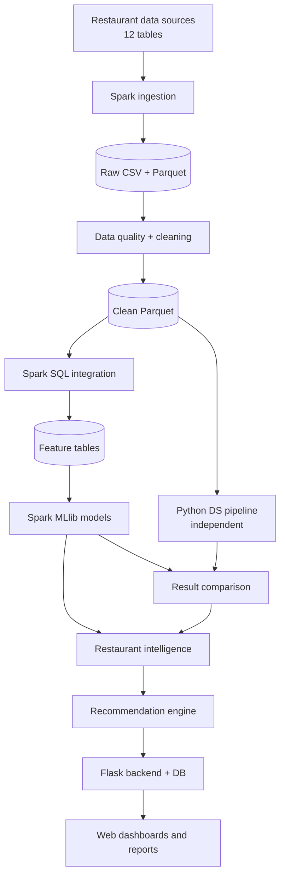
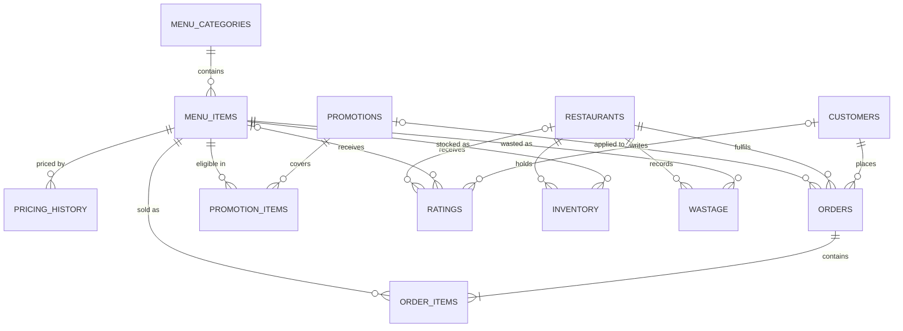
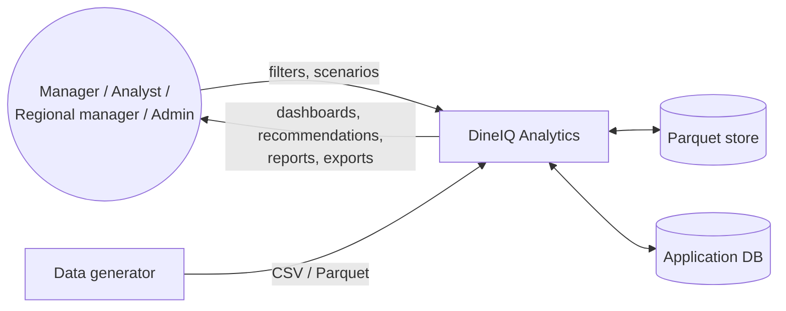
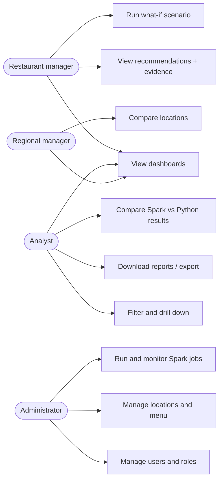
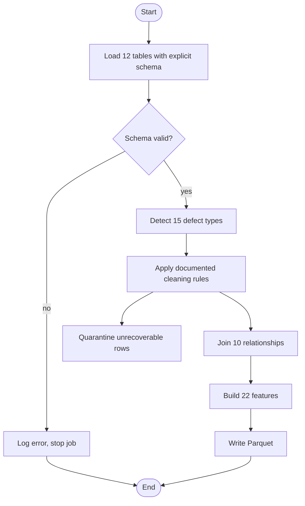
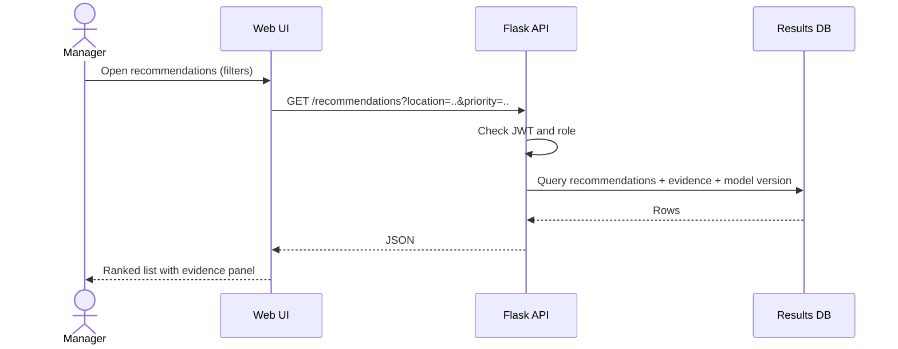

# DineIQ Analytics: Project Report

**Theme:** MenuMatrix Dining Intelligence · **Category:** Data Science Intelligence Arena · **Specification:** SRS v1.0
**Status:** skeleton (2026-09-29). The named owner fills each _Pending_ section from files listed in the [Evidence Index](evidence/EVIDENCE_INDEX.md). No figure may be typed in without a source file.

---

## 1. Problem definition

Restaurants generate large, interconnected data: orders, menu, prices, promotions, ratings, inventory and wastage. They usually analyze it with spreadsheets and basic reports, which cannot reveal how profitability, customer behavior, promotions, wastage, location and time interact. A best-selling dish may be losing money, and a promotion may raise sales while destroying margin.

## 2. Background and business necessity

The decisions that matter are menu composition, pricing, promotions, preparation quantities and customer targeting. Each one depends on several indicators at once. The SRS says volume alone must not make a dish "successful" (Step 9), and sales alone must not make a promotion successful (Step 27). Answering these questions needs Big Data processing plus predictive analytics.

## 3. Proposed solution

A web platform backed by two independent analytical pipelines:

1. **Big Data pipeline:** Apache Spark, PySpark, Spark SQL and Spark MLlib.
2. **Python Data Science pipeline:** Pandas, Scikit-learn and XGBoost, working on the same underlying records.

Both pipelines solve selected tasks independently, and their outputs are compared record by record. The results feed a recommendation engine and dashboards, where every recommendation shows its evidence.

## 4. Purpose of the document

This report describes the design, implementation and evaluation of DineIQ Analytics. It is written for evaluators, developers, restaurant managers, analysts and administrators.

## 5. Scope

**In scope:**
- synthetic dataset generation;
- Spark ingestion, cleaning, integration and features;
- menu intelligence, customer intelligence and basket analysis;
- forecasting, wastage, pricing, promotions and anomalies;
- dual pipelines and their comparison;
- recommendations and what-if analysis;
- dashboards, reports and export.

**Out of scope (SRS §1.4):** live POS, payment gateways, third-party delivery platforms and enterprise restaurant systems.

## 6. Assumptions

- The data is synthetic and covers calendar year 2024. The 20 locations are named after cities in Yemen, and amounts use a single currency.
- The hidden evaluation dataset follows the 12-table schema in the data dictionary.
- NFR 1 of the SRS ("uploaded claim details") is read as "uploaded restaurant records".

## 7. Constraints

- Results depend on how realistic the generated data is.
- Spark runs at laptop scale, in local mode.
- Independent models can legitimately disagree.
- Customer and business data must be handled according to data-protection rules (§40–41).

## 8. Functional requirements: coverage

| FR | Area | Owner | Status |
|---|---|---|---|
| i–ii | Authentication, role-based access | S4 | ⬜ |
| iii–xi | Locations, menu, pricing, customers, orders, promotions, ratings, inventory, wastage data | S1 (data), S4 (management UI) | ⏳ |
| xii–xix | Ingestion, schema validation, quality, cleaning, Spark SQL, partitioning, Parquet, features | S1 | ⏳ |
| xx–xli | Profitability, classification, peaks, segments, RFM, basket, forecasting, wastage, pricing, promotions, ratings, anomalies, locations, channels, churn | S2 | ⬜ |
| xlii–xlvi | Spark and Python models, comparison, competency, evaluation | S2 | ⬜ |
| xlvii–li | Recommendations, what-if analysis | S3 | ⬜ |
| lii–lx | Dashboards, filtering, reports, export | S3/S4 | ⬜ |
| lxi–lxvi | Database, model versioning, audit trail, error handling, Spark job monitoring, responsive UI | S4 | ⬜ |

## 9. Non-functional requirements

| NFR | Target | How it is verified |
|---|---|---|
| Performance | Predictions from both models within 5 s | Timed API test _(pending S4)_ |
| Scalability | Handles 5M order lines without redesign | Generator scale-up run + Spark timings _(pending S1)_ |
| Usability | Intuitive UI for four roles | Walkthrough in demo video |
| Accuracy | Classification ≥ 85% accuracy or macro-F1 ≥ 0.80; forecasts beat baseline | `reports/mllib/`, `reports/python/` _(pending S2)_ |
| Availability | 99% uptime during evaluation | Hosting status page _(pending S4)_ |

## 10. System architecture

## 11. Big Data architecture

| Layer | Format | Content | Status |
|---|---|---|---|
| Raw | CSV (≈68 MB) | 12 tables with intentional defects | ✅ |
| Raw columnar | Parquet (≈21 MB) | Same 12 tables | ✅ |
| Clean | Parquet | Rule-based cleaned tables and quarantine | ⏳ S1 |
| Features | Parquet | 22 analytical features (Step 7) | ⏳ S1 |
| Results | Parquet/CSV + DB | Predictions, classes, forecasts, recommendations | ⬜ S2/S3 |

Partition strategy: _Pending S1 (e.g. by order month and restaurant)._

## 12. Module descriptions

| Module | Responsibility | Owner |
|---|---|---|
| Data generator | Reproducible synthetic dataset (seed, separate config, validation report) | S1 |
| Spark jobs (U11–U14) | Ingestion, quality, cleaning, features | S1 |
| ML and analytics | Classification, segmentation, forecasting, basket, anomalies, dual pipelines | S2 |
| Recommendation and UI | Evidence-based recommendations, what-if, dashboards | S3 |
| Backend | Auth, RBAC, DB, export, audit, deployment | S4 |
| Quality and documentation | Tests, evidence, report, submission | S6 |

## 13. Database design

_Pending S4: engine, tables for users/roles, results, recommendations, audit log, model versions._

## 14. Entity relationship design

## 15. Data dictionary

See [data_dictionary/DATA_DICTIONARY.md](data_dictionary/DATA_DICTIONARY.md) for the 12 tables, their types, nullability, PK/FK and allowed values. `Menu_Items.launch_date` is still to be added there.

## 16. Data flow diagram (level 0)

## 17. Use case diagram

## 18. Activity diagram: data pipeline

## 19. Sequence diagram: viewing a recommendation (draft, confirm with S4)

## 20. Analytical workflow

The analysis runs in this order:

1. Raw data
2. Data quality
3. Clean data
4. Integration
5. Features
6. Spark models and Python models, trained in parallel
7. Comparison
8. Intelligence
9. Recommendations
10. Dashboards and reports

## 21. Dataset-generation methodology

The Python generator (`data_generator/`) builds 12 related tables in seven stages:
1. dimensions;
2. pricing history;
3. promotions;
4. orders and order lines;
5. ratings;
6. inventory;
7. wastage.

It then injects the raw-data defects and writes every table to CSV (≈68 MB) and Parquet (≈21 MB). All parameters live in `config.py`, and every run is reproducible from its seed (default 42). A validation step writes `data_generation_validation.json` and `dataset_statistics.json`.

| Table | Rows |
|---|---|
| Customers | 50,000 |
| Restaurants | 20 |
| Menu_Categories | 10 |
| Menu_Items | 150 |
| Pricing_History | 689 (3–6 prices per item) |
| Promotions | 30 |
| Promotion_Items | 181 |
| Orders | 101,000 (100,000 unique + 1% injected duplicates) |
| Order_Items | 1,066,785 |
| Ratings | 100,518 (100,000 + 518 anomaly-cluster ratings) |
| Inventory | 159,000 (weekly snapshots per item and location) |
| Wastage | 50,000 |

How the generator creates each business pattern (source: `data_generator/generators/*.py`):

| Pattern | Mechanism |
|---|---|
| Popular items | 4× demand weight |
| Loss-making bestsellers | Popular + low-margin items with cost set to 105–115% of price |
| Profitable low-sellers | 0.3× demand weight; cost 20–35% of price |
| Low-margin / high-rated poor-profit items | Cost 80–92% of price; high-rated items have a rating mean of 4.5 |
| Low-rated high-sales items | 2.6× demand; rating mean 2.1 |
| High-wastage items | 7× wastage frequency and 2.5× wasted quantity; 3 items are forced to be both popular and high-wastage |
| Weekend-only items | 15× demand at weekends, 0.2× on weekdays |
| Seasonal items | 5× demand in a 3-month season, 0.3× otherwise |
| New items | First sold in the last 60–120 days of the year; `launch_date` up to 20 days earlier |
| Price-sensitive items | Demand × (base price ÷ current price)^2.5 |
| Promotion-dependent items | 5× demand inside their promotion windows, 0.1× outside |
| Promotion traps | 8 promotions with 40–55% discounts and a 5× demand lift |
| Location differences | Per item: 2 strong locations (3–6×) and 2 weak locations (0.1–0.25×) |
| Sales anomalies | 12 three-day events per item: a ×10 spike or a ×0.01 drop |
| Rating anomalies | 2 spikes (60–90 ratings of 4–5), 2 drops (60–90 ratings of 1–2), 2 single-day bursts (80–120 ratings) |
| Customer segments | New 10%, churned 15% (no orders in the last 120 days), high-value 10%, frequent 15%, occasional 50% |
| Calendar | Friday–Sunday 1.35×, December 1.4×, June–July 1.2×; orders from 08:00 to 23:59 with lunch and dinner peaks |
| Channels | Dine-in 35%, Takeaway 22%, Website/App 18%, Third-party delivery 20%, Other 5% |
| Order status | Completed 88%, cancelled 5%, refunded 5%, pending 2% |

Difficult-case counts measured by Student 1 on the generated data (Step 11):

| Case | Items |
|---|---|
| High-selling but loss-making | 4 |
| Profitable but rarely purchased | 19 |
| Popular with excessive wastage | 12 |
| Highly rated but poorly profitable | 7 |
| Low-rated but high-selling | 4 |
| Promotion-dependent | 13 |
| Differs across locations | 139 |
| Weekend-only | 14 |
| Seasonal | 21 |
| New with insufficient history | 12 |

## 22. Data-quality methodology

The generator injects the 15 defect types of SRS Step 4 after building the clean tables (`anomalies.py`, `wastage.py`). Two independent tools detect them:
- the Spark quality engine (S1);
- a pandas detector (`tests/quality_checks.py`, S6).

The two sets of counts are then compared.

| # | Defect | How it is injected | Count (handoff) |
|---|---|---|---|
| 1 | Missing values | 0.4% blanks in order totals, unit cost, base price, pricing, wastage reason | 4,674 |
| 2 | Duplicate orders | 1% exact row copies | 1,000 |
| 3 | Duplicate order lines | 1% exact row copies | 10,562 |
| 4 | Invalid menu prices | 0.2% set to −10 or 99,999.99 (menu, order lines, pricing) | 1 (menu only) |
| 5 | Negative quantities | 0.2% of order-line quantities and inventory consumption negated | 2,133 |
| 6 | Invalid dates | 0.2% set to blank or 2099-12-31 (orders, ratings, wastage) | 101 |
| 7 | Invalid ratings | 0.3% set to 0, −1, 6, 10 or 100 | 301 |
| 8 | Missing customer IDs | 0.3% of orders | 303 |
| 9 | Missing menu IDs | 0.3% of order lines | 3,200 |
| 10 | Invalid restaurant IDs | 0.2% of orders set to −999 | 202 |
| 11 | Impossible wastage | 2% forced above the latest prior closing stock | 74 ⚠ (code implies ≈1,000) |
| 12 | Incorrect discounts | 0.2% of lines with discount greater than gross value | 2,134 |
| 13 | Cancelled transactions | 5% order status | 5,025 |
| 14 | Inconsistent units | 0.3% of inventory/wastage units set to kg, liter, gram, ml or box | 627 |
| 15 | Invalid location references | Same −999 references as #10 | 202 |

Cleaning rules and outcomes: _Pending S1 (`cleaning_report.json`)._

## 23. Spark-processing pipeline
_Pending S1: U11 ingestion (explicit vs inferred schema, multiple files, partitions), U12 quality, U13 cleaning, U14 features; execution logs and timings._

## 24. Spark SQL processing
_Pending S1: the queries, what each answers, and sample outputs._

## 25. Feature engineering
Planned features (SRS Step 7):
- **Item:** revenue, cost, contribution margin, profit %, order frequency, popularity, repeat-purchase rate.
- **Ratings, wastage and pricing:** average rating, rating trend, wastage %, promotion dependency, discount %, price-change %.
- **Customer (RFM):** recency, frequency, monetary value, average order value.
- **Time, location and channel:** peak-hour frequency, weekend-order ratio, location performance, channel preference, basket size.

_Pending S1: definitions and formulas as implemented._

## 26. Menu classification methodology
_Pending S2: indicators, thresholds, how the four classes are assigned without a single hard-coded field, and how the difficult cases are handled._

## 27. Customer segmentation
_Pending S2._

## 28. RFM analysis
_Pending S2._

## 29. Market-basket analysis
_Pending S2: algorithm, minimum support and confidence, top rules with support/confidence/lift._

## 30. Demand forecasting
_Pending S2: model, chronological split dates, MAE/RMSE/MAPE vs baseline._

## 31. Wastage analysis
_Pending S2._

## 32. Pricing analysis
_Pending S2._

## 33. Promotion analysis
_Pending S2._

## 34. Anomaly detection
_Pending S2._

## 35. Spark MLlib model design
_Pending S2: features, at least 3 algorithms, hyperparameters, selected model and why._

## 36. Python model design
_Pending S2: features, algorithms, hyperparameters, selected model and why._

## 37. Dual-pipeline result comparison
_Pending S2: task compared, at least 100 unseen records, agreement %, major disagreements explained._

## 38. Model evaluation
_Pending S2: metrics tables and confusion matrices, linked to `reports/`._

## 39. Testing strategy
See [testing/TEST_PLAN.md](testing/TEST_PLAN.md). The latest results are in [reports/test_results/TEST_RESULTS.md](../reports/test_results/TEST_RESULTS.md).

## 40. Security considerations
The backend dependencies chosen by S4 provide these planned controls (**confirm** they are implemented and tested):
- Password hashing with bcrypt (Flask-Bcrypt).
- Token-based authentication (Flask-JWT-Extended), with role-based authorization for managers, analysts, regional managers and administrators.
- Rate limiting on login and API routes (Flask-Limiter).
- Secrets loaded from environment variables (python-dotenv); `.env` is excluded by `.gitignore`.
- An audit trail of jobs, predictions, exports and admin actions (FR lxiii).

## 41. Privacy considerations
- The Customers table holds only a numeric ID and a registration date. It has no names, emails, phone numbers or addresses.
- All data is synthetic.
- Ratings and orders refer to customers only by ID, and 30% of ratings are anonymous.
- Exports are restricted by role and contain IDs, never personal data.

## 42. Limitations
- One year of data gives a single observation of each season.
- Spark runs in local mode on a laptop.
- Synthetic data is more regular than real POS data.
- _Add any SRS feature not completed by submission._

## 43. Future enhancements
- Live POS and delivery-platform integration (out of scope now).
- Streaming ingestion with Spark Structured Streaming.
- Multi-year data for seasonal models.
- Automated retraining with model-drift monitoring.
